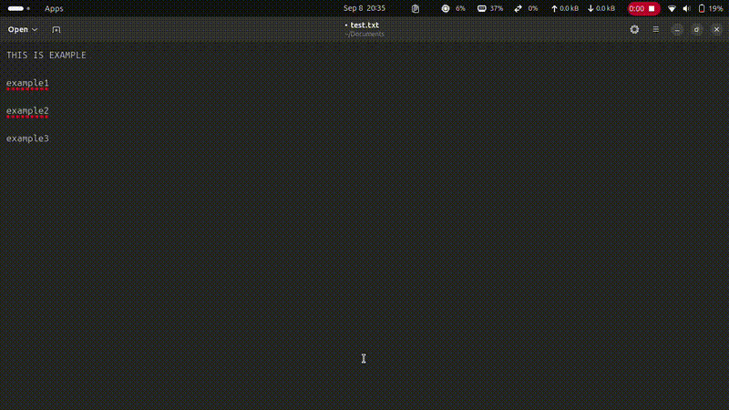

# clipboard-quickpaste-gnome-shell-extension
Clipboard quick paste is a clipboard manager gnome-shell-extension that allows you to quickly paste previously copied text from a list of 50 stored items.



## Install
Clone the repository to your preferred folder and run the 'make install' command.
To activate the extension, you'll need to logout and login to your computer. This way, gnome shell will recognize the extension and you can use it.
```bash
$ cd <your-folder>
$ git clone https://github.com/0-meeseeks-0/clipboard-quickpaste-gnome-shell-extension.git
$ make install
```
After logout and login if extension not start run:
```bash
$ gnome-extensions enable clipboard-quickpaste@meeseeks.com
```

## Usage
To use the extension you need to press the key combination ctrl+right arrow, keeping the ctrl pressed to keep the window visible and moving with the arrows.
When you release the ctrl the displayed text will be pasted automatically.
